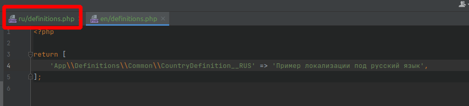
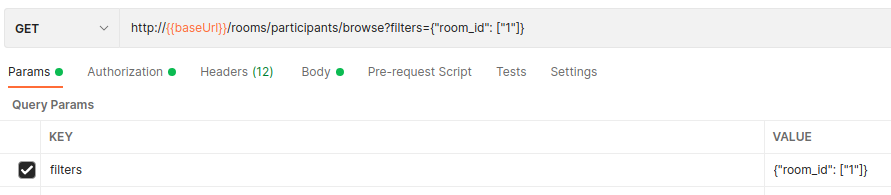

# Оглавление
- [Установка](#install)
- [Важно](#attention)
- [Компоненты и как их использовать](#componentsAndHowToUse)
  - [Трейт `UploadImages` (`Mrzlanx532\LaravelBasicComponents\Traits\Model\UploadImages\UploadImages)`](#uploadImages)
  - [Трейт `UploadFile` (`Mrzlanx532\LaravelBasicComponents\Traits\Model\UploadFile\UploadFile)`](#uploadFile)
  - [Класс `Service` (`Mrzlanx532\LaravelBasicComponents\Service`)](#service)  
  - [Класс `Definition` (`Mrzlanx532\LaravelBasicComponents\Definition\Definition`)](#definition)  
  - [Класс `PanelForm` (`Mrzlanx532\LaravelBasicComponents\PanelForm\PanelForm`)](#panelForm)  
  - [Класс `QueryBuilder` (`Mrzlanx532\LaravelBasicComponents\QueryBuilder`)](#queryBuilder)  
  - [Класс `PanelSet` (`Mrzlanx532\LaravelBasicComponents\PanelSet\PanelSet`)](#panelSet)  
  - [Класс `PanelSetSortable` (`Mrzlanx532\LaravelBasicComponents\PanelSetSortable\PanelSetSortable`)](#panelSetSortable)  
  - [Класс `BrowserFilterPresetController` (`Mrzlanx532\LaravelBasicComponents\Controllers\BrowserFilterPresetController`)](#browserFilterPresetController)

## <a name="install">Установка</a>

1. Устанавливаем пакет: `composer require mrzlanx532/laravel-basic-components`
2. Публикуем настройки: `php artisan vendor:publish --tag="laravel-basic-components-config"`
3. Публикуем миграции: `php artisan vendor:publish --tag="laravel-basic-components-migrations"`
4. Если в проекте не используется `browser` (компонент, который используется в админке), удаляем миграцию `create_duotek_browser_filters_presets`.
4. Выполняем команду: `php artisan migrate`

## <a name="attention">Важно</a>
1. При установке пакета устанавливается `middleware` для группы `api` `Mrzlanx532\LaravelBasicComponents\Middleware\ReplaceNullValuesInFormData`
2. Приложение должно работать в `UTC (00:00)`, соответственно, в конфиге `config.app` должно быть:  
`timezone => 'UTC'`
3. Все даты для `datetime` и `timestamp` при сохранении должны приводится к `UTC (00:00)`

## <a name="componentsAndHowToUse">Компоненты и как их использовать</a>
### <a name="uploadImages">Трейт `UploadFile` (`Mrzlanx532\LaravelBasicComponents\Traits\Model\UploadImages\UploadImages`)</a>
#### Зачем нужен?
1) **Сохранение\Обновление** изображений из параметров `Request` с учетом конфигурации в модели   
( _в модели определяется нарезать ли картинки и как нарезать_ )
2) При **обновлении** также удаляются предыдущие файлы с сервера
#### Как использовать?
1. Трейт вставляется в модель, которая имеет изображения в свойствах.  
Для правильной конфигурации необходимо в свойство модели `$filePropertiesWithSettings` поместить конфиг по примеру ниже:
```php
...
use UploadImages;
...
/**
 * Если есть константа UPLOAD_FILE_TRAIT_DELETING_FILES и она true,
 * то при удалении модели также будут удаляться связанные с ней изображения (и нарезки)
 */
const UPLOAD_FILE_TRAIT_DELETING_FILES = true;

public static $filePropertiesWithSettings = [
    'picture' => [
        '200' => [200, 200, FileHelper::RESIZE_TYPE_SMART],
        '400' => [400, 400, FileHelper::RESIZE_TYPE_FIT_INTO_AREA_WITH_PROPORTIONS],
        '600' => [600, 600, FileHelper::RESIZE_TYPE_FIT_INTO_AREA_WITH_PROPORTIONS_AND_COLOR_CANVAS, '#ffffff', 'center'], // Возможные значение 4-го параметра: top-left, top, top-right, left, center, right, bottom-left, bottom, bottom-right
    ],
    'background_picture' => null, // null означает сохранить как есть (без нарезок)
];
...
```
2. Для корректного вывода в ресурсах делаем так:
```php
...
class UserResource extends JsonResource
{
    /* @var $resource User */
    public $resource;

    /**
     * @throws InvalidFilePropertiesWithSettingsPropertyConfiguration
     */
    public function toArray($request): array
    {
        return [
            'id' => $this->resource->id,
            'photo' => $this->resource->getFileLinksBySettings('photo'),
            'photo2' => $this->resource->getFileLinksBySettings('photo2', 'http://api.tip.ru'), // возможность кастомно задать домен, не смотря на UPLOAD_FILE_DOMAIN  
        ];
    }
}
```
3. Если нужно чтобы файлы отдавались с абсолютным путем через метод `getFileLinksBySettings` можно:
* Глобально добавить `UPLOAD_FILE_DOMAIN=http://api.example.ru` в `.env` файл в корне проекта
* Локально добавить `->getFileLinksBySettings('photo', 'http://api.example.ru')`

4. Если нужно в обособленном ресурсе, не привязываясь к классу, вывести изображения по конфигу модели: 
```php
...
use Mrzlanx532\LaravelBasicComponents\Helpers\FileHelper\FileHelper;
...
class UserResource extends JsonResource
{
    /* @var $resource User */
    public $resource;

    /**
     * @throws InvalidFilePropertiesWithSettingsPropertyConfiguration
     */
    public function toArray($request): array
    {
        return [
            'id' => $this->resource->id,
            'photo1' => FileHelper::getFileLinksBySettings(User::class, 'photo1', $this->resource->photo1),
            'photo2' => FileHelper::getFileLinksBySettings(User::class, 'photo2', $this->resource->photo2),  
        ];
    }
}
```

### <a name="uploadFile">Трейт `UploadFile` (`Mrzlanx532\LaravelBasicComponents\Traits\Model\UploadFile\UploadFile`)</a>
#### Зачем нужен?
Трейт применяется к смежным таблицам. (например: таблица `user_files`, где есть колонка `user_id` и `file_id`)  
Позволяет удобно сохранять, обновлять, удалять файлы взаимодействуя с таблицей `files`.   
Также позволяет удобно настраивать конфигурацию сохранения (см. ниже)    

При обновление модели удаляет предыдущий файл и заменяет новым.  
При удаление модели удаляет файл (если нету трейта `SoftDeletes`).  
При удалении через `forceDelete` файл тоже физически удаляется.   
#### Как использовать?
1. Создаем модель для промежуточной таблицы файлов (например: `user_files`)
```php
<?php

namespace App\Models;

use App\Config\UploadFileConfig;
use Illuminate\Database\Eloquent\Model;
use Illuminate\Database\Eloquent\SoftDeletes;
use Illuminate\Http\UploadedFile;
use Illuminate\Support\Carbon;
use Illuminate\Database\Eloquent\Builder;
use App\Traits\UploadFile;

/**
 * \App\Models\UserFile
 *
 * @property int id
 * @property int user_id
 * @property int file_id
 * @property Carbon|null deleted_at
 *
 * @property UploadedFile|null uploadFile
 * @property-read File $file;
 *
 * @method static Builder|ContactFile query()
 * @method static ContactFile|null find($id)
 * @method static ContactFile findOrFail($id)
 *
 * @mixin Model
 */
class UserFile extends Model
{
    use UploadFile; // Добавляем трейт
    use SoftDeletes; // Добавляем SoftDeletes, если требуется

    protected $table = 'user_files';

    const $timestamps = false;
    
    /**
     * Если настройки по-умолчанию не подходят, то создаем метод getUploadFileConfig 
     */
    public function getUploadFileConfig(): UploadFileConfig
    {
        return UploadFileConfig::create()
            ->setAsPublic()
            ->setForeignKey('file_id');
    }
}
```
2. Применяем в сервисе.
```php
...
$user = new User;
$user->save();

if (isset($this->params['files'])) {
    foreach ($this->params['files'] as $passedFile) {
        $file = new UserFile;
        
        // Свойство `uploadFile` является зарезервированным.
        // $passedFile является \Illuminate\Http\UploadedFile
        $file->uploadFile = $passedFile;

        $files[] = $file;
    };

    $user->files()->saveMany($files);
}
...
```

3. Итог
У нас сохранились файлы в `storage/app/private/files/<год>/<месяц>/<день>/<хэш_от_файла>.<расширение_файла>`.  
Добавились в таблицу `files` и создалась связь в таблице `user_files`

### <a name="service">Класс `Service` (`Mrzlanx532\LaravelBasicComponents\Service`)</a>
#### Зачем нужен?
Сервис является **обязательным** для использования при `POST`-действиях.  
Например: `Создание клиента`, `Изменение статуса заказа`, `Обновления данных клиента`, `Удаления клиента`
#### Как использовать?
1. Создаем сервис
```php

namespace App\Services\Finance\BalanceInvoice;

use App\Models\Finance\BalanceInvoice as FinanceBalanceInvoice;
use Mrzlanx532\LaravelBasicComponents\Service\Service;

class FinanceBalanceInvoiceCreateService extends Service
{
    public function getRules(): array
    {
        return [
            'user_id' => 'required|int|exists:users_users,id',
            'base_type_id' => 'required|string',
            'offer_id' => 'required|int|exists:market_offers_offers,id',
            'state_id' => 'required|string',
            'total' => 'required|numeric',
        ];
    }

    public function handle(): FinanceBalanceInvoice
    {
        $balanceInvoice = new FinanceBalanceInvoice();

        $balanceInvoice->user_id = $this->params['user_id'];
        $balanceInvoice->offer_id = $this->params['offer_id'];
        $balanceInvoice->base_type_id = $this->params['base_type_id'];
        $balanceInvoice->state_id = $this->params['state_id'];
        $balanceInvoice->total = $this->params['total'];

        $balanceInvoice->save();

        return $balanceInvoice;
    }
}
```
2. Применяем в контроллере
```php
...
public function create(Request $request, FinanceBalanceInvoiceCreateService $financeBalanceInvoiceCreateService): JsonResponse
{
    return response()->json(
        new FinanceBalanceInvoiceResource(
            $financeBalanceInvoiceCreateService->setParams($request)->handle()
        )
    );
}
...
```
#### Важные нюансы
1. `params` в методе `getRules` доступны в чистом виде (всё что приходит с `Request` или `array`)
2. `params` в методе `handle` очищены от полей, которые отсутствуют в `getRules` 
### <a name="definition">Класс `Definition` (`Mrzlanx532\LaravelBasicComponents\Definition\Definition`)</a>
#### Зачем нужен?
Используется для хранения констант в определенном формате.  
Имеет множество методов для удобной работы с ними.
#### Как использовать?
```php

namespace App\Definitions\Finance\Balance;

use Mrzlanx532\LaravelBasicComponents\Definition\Definition;

class InvoiceBaseDefinition extends Definition
{
    const OFFER = 'OFFER';

    public static function items(): array
    {
        return [
            self::OFFER => [
                'id' => self::OFFER,
                'title' => 'Оплата объявления',
            ],
        ];
    }
} 
```
#### Как локализовать `title`?
##### Как заполнить локализацию?

##### Как вызвать все константы с учётом локализации?
```php
$definition::getItems(withLocale:true)
$definition::getItems(withLocale:true, specifiedLocale:'ru')
```
##### Как вызвать одну константу с учётом локализации?
```php
$definition::getItemByConst('RUS');
$definition::getItemByConst(const:'RUS', withLocale:true, specifiedLocale:'ru');
$definition::getItemByConst(const:'RUS', withLocale:true);
```

### <a name="panelForm">Класс `PanelForm` (`Mrzlanx532\LaravelBasicComponents\PanelForm\PanelForm`)</a>
#### Зачем нужен?
Используется в качестве соглашения с библиотекой на фронтенде для данных, которые должны быть получены для формы.  
> Используется исключительно в админках.
#### Как использовать?
1. Создаем `PanelForm`
```php

namespace App\PanelForms\Backoffice\Users;

use App\Http\Resources\Backoffice\Users\User\UserResource;
use App\Models\Users\User;
use Mrzlanx532\LaravelBasicComponents\PanelForm\PanelForm;

class UserPanelForm extends PanelForm
{
    protected string $model = User::class;
    protected string|null $resource = UserResource::class;

    protected function getInputs(): array
    {
        return [];
    }
}
```
2. Применяем в контроллере
```php
...
public function form(UserPanelForm $userPanelForm): JsonResponse
{
    return response()->json($userPanelForm->get());
}
...
```
### <a name="queryBuilder">Класс `QueryBuilder` (`Mrzlanx532\LaravelBasicComponents\QueryBuilder`)</a>
#### Зачем нужен?
Нужен для построения сложных запросов с участнием `Illuminate\Http\Request` и соответственно инкапсуляции логики
#### Как использовать?
1. Создаем `QueryBuilder`
```php
namespace App\Http\QueryBuilders;

use App\Models\Finance\BalanceTransaction;
use Mrzlanx532\LaravelBasicComponents\QueryBuilder\QueryBuilder;
use Illuminate\Database\Eloquent\Collection;

class FinanceBalanceTransactionQueryBuilder extends QueryBuilder
{
    public function handle(): Collection|array
    {
        $balanceTransactionQuery = BalanceTransaction::query();
        
        if ($this->request->has('user_id')) {
            $balanceTransactionQuery->where('user_id', $this->request->get('user_id'))
        }
        
        return $balanceTransactionQuery->get();
    }
}
```
2. Используем в контроллере
```php
...
public function list(Request $request): JsonResponse
{
    return response()->json(
        FinanceBalanceTransactionResource::collection(
            (new FinanceBalanceTransactionQueryBuilder($request))->handle()
        )
    );
}
...
```
#### Важные нюансы
1. `params` в методе `getRules` доступны в чистом виде (всё что приходит с `Request` или `array`)
2. `params` в методе `handle` очищены от полей, которые отсутствуют в `getRules`

### <a name="panelSet">Класс `PanelSet` (`Mrzlanx532\LaravelBasicComponents\PanelSet\PanelSet`)</a>
#### Зачем нужен?
Используется в качестве соглашения с библиотекой на фронтенде для определения интерфейса на фронтенде через бэкенд.  
> Используется исключительно в админках.
#### Как использовать?
1. Создаем `PanelSet`
```php

namespace App\PanelSet;

use App\Http\Resources\Web\MarketOffer\MarketOfferResource;
use App\Models\Market\Offer\Offer as MarketOffer;
use Mrzlanx532\LaravelBasicComponents\PanelSet\Filters\BooleanFilter;
use Mrzlanx532\LaravelBasicComponents\PanelSet\Filters\SelectFilter;
use Mrzlanx532\LaravelBasicComponents\PanelSet\PanelSet;

class MarketOfferPanelSet extends PanelSet
{
    protected string $model = MarketOffer::class;
    public string $resource = MarketOfferResource::class;
    public string $browserId = 'market_offers';
    
    /**
     * Если необходимо передать кастомный способ поиска отличный от LIKE, делаем как в примере 1 
     */
    public array $fieldsForDefaultSearchFilter = ['costs_type_id', 'payment_type_id'];
    
    protected array $defaultOrderBy = [
        'created_at' => 'desc',
        // Пример с мапингом: принимаем `created_at`, а в запрос кладем `tips_codes.created_at`
        // 'created_at as tips_codes.created_at' => 'desc'
        // Для кастомизации смотри "Пример 2"
    ];
    
    public array $availableOrderBy = [
        'created_at',
        // Пример с мапингом: принимаем `created_at`, а в запрос кладем `tips_codes.created_at`
        // 'created_at as tips_codes.created_at' 
        // Для кастомизации смотри "Пример 3"
    ];   
    
    public function __construct() 
    {
        parent::__construct();
        
        /**
         * Пример 1 
         */
        $this->fieldsForDefaultSearchFilter = [
            'costs_type_id',
            'payment_type_id',
            function (Builder $query, string|null $searchString) {
                $query->OrWhere('id', '=', $searchString);
            }
        ];
        
        /**
         * Пример 2 
         */
        $this->defaultOrderBy = [
            'created_at' => function (\Illuminate\Database\Eloquent\Builder $queryBuilder) {
                // Пример кастомизации: здесь пишем как обработать поле 'updated_at'
                $queryBuilder->orderByRaw('<RAW SQL QUERY>');
            }
        ];    
        
        /**
         * Пример 3 
         */
        $this->availableOrderBy = [
            'created_at' => function (\Illuminate\Database\Eloquent\Builder $queryBuilder, $field, $direction) {
                // Пример кастомизации: здесь пишем как обработать поле 'updated_at'
                $queryBuilder->orderByRaw('<RAW SQL QUERY>');
            }
        ]; 
    }

    protected function setFilters()
    {
        $this->filtersManager->add(SelectFilter::class, 'product_id', 'Продукт', function (SelectFilter $selectFilter) {
        
            $exampleOptions = [
                0 => [
                    'id' => 1,
                    'title' => 'Продукт1'    
                ],
                1 => [
                    'id' => 2,
                    'title' => 'Продукт2'    
                ],
            ];
            
            $selectFilter->setOptions($exampleOptions);
        });
        
        $this->filtersManager->add(BooleanFilter::class, 'is_price_per_one_is_set', 'Тест', function (BooleanFilter $booleanFilter) {
        
            // В запрос передаем вместо 'is_price_per_one_is_set' => 'is_price_per_one_is'
            $booleanFilter->setFilterParamName('is_price_per_one_is');
            
            // Скрываем из интерфейса, но обрабатываем всё равно 
            $booleanFilter->hidden(); 
            
            // Делаем фильтр обязательным
            $booleanFilter->required();
        });
        
        // Пример кастомного запроса
        $this->filtersManager->add(SelectFilter::class, 'randomValue(ни на что не влияет в случае кастома)', 'Участник', function (SelectFilter $selectFilter) {
            $selectFilter
                ->setFilterParamName('user_id');
                ->setCustomQueryClosure(function (\Illuminate\Database\Eloquent\Builder $builder, $values) {
                    $builder
                        ->where('market_deals.requester_user_id', $values[0])
                        ->orWhere('market_deals.responser_user_id', $values[0]);
            });
        });
    }
}
```
2. Используем в контроллере
```php
...
/**
 * @throws InvalidJsonFormatForFiltersParameterException
 * @throws InvalidPanelSetConfigurationException
 */
public function browse(MarketOfferPanelSet $marketOfferPanelSet): JsonResponse
{
    return response()->json($marketOfferPanelSet->handle());
}
...
```
#### Дополнительно:
Пример из `POSTMAN` как управляться с фильтрами:



### <a name="panelSetSortable">Класс `PanelSetSortable` (`Mrzlanx532\LaravelBasicComponents\PanelSetSortable\PanelSetSortable`)</a>
#### Зачем нужен?
Используется в качестве соглашения с библиотекой на фронтенде для определения интерфейса на фронтенде через бэкенд.
> Нужен для компонента на фронте, который имеет Drag'n'Drop  
> 
> Компонент определяет порядок записей   
> и может вкладывать одну запись в другую (опционально)
#### Как использовать?
1. Создаем `PanelSetSortable`
```php
<?php

namespace App\PanelSets\Backoffice\Suppliers\Levels;

use App\Http\Resources\Backoffice\Suppliers\Levels\LevelListResource;
use App\Models\Suppliers\Levels\Level;
use Mrzlanx532\LaravelBasicComponents\PanelSetSortable\PanelSetSortable;

class LevelPanelSetSortable extends PanelSetSortable
{
    protected string $model = Level::class;
    public string $resource = LevelListResource::class;
    
    /** [Опционально] Определяем нужна ли поддержка вложенности */
    protected bool $isNested = false;
    
    /** [Опционально] Колонка в таблице, которое будет отвечать за порядок */
    protected string $orderField = 'order_index';
    
    /** [Опционально] Колонка в таблице, которая определяет родителя при включенной вкложенности */
    protected string $parentField = 'parent_id';
    
    /** [Опционально] Колонка, содержащая в себе первичный ключ таблицы */
    protected string $identifierField = 'id';
}
```
2. Используем в контроллере
```php
use App\PanelSets\Backoffice\Suppliers\Levels\LevelPanelSetSortable;
use Illuminate\Http\JsonResponse;

/**
 * GET
 * suppliers/levels/browse-sortable
 * [backoffice-api]
 * Браузер уровней поставщиков сортированный
 *
 * @param LevelPanelSetSortable $levelPanelSetSortable
 * @return JsonResponse
 */
public function browseSortable(LevelPanelSetSortable $levelPanelSetSortable): JsonResponse
{
    return response()->json($levelPanelSetSortable->handle());
}
```

3. Добавляем метод обновления **сортировки\вложенности** в контроллер
```php
use Mrzlanx532\LaravelBasicComponents\Service\PanelSetSortableUpdateService\PanelSetSortableUpdateService;
use App\PanelSets\Backoffice\Suppliers\Levels\LevelPanelSetSortable;
use Illuminate\Http\JsonResponse;
use Illuminate\Http\Request;

/**
 * POST
 * suppliers/levels/browse-sortable/update
 * [backoffice-api]
 * Обновить сортировку браузера
 *
 * @bodyParam items object[] required
 * @bodyParam items[].id int required
 * @bodyParam items[].parent int required (если вложенность отключена, убираем из доки)
 *
 * @param Request $request
 * @return JsonResponse
 * @throws ValidationException
 */
public function browseSortableUpdate(Request $request): JsonResponse
{
    (new PanelSetSortableUpdateService(LevelPanelSetSortable::class))->setParams($request)->handle();

    return response()->json(['status' => true]);
}
```

### <a name="browserFilterPresetController">Класс `BrowserFilterPresetController` (`Mrzlanx532\LaravelBasicComponents\Controllers\BrowserFilterPresetController`)</a>
#### Зачем нужен?
Используется в качестве соглашения между фронтендом и бэкэндом.  
Содержит в себе контроллер с методами для **сохранения\изменения\удаления** пользовательских пресетов.
#### Как использовать?
Вставляем машруты в файл с роутами (там где необходимо).
> Используется исключительно в админках, вместе с компонентом `PanelSet`
```php
...
Route::post('browser/preset/create', [BrowserFilterPresetController::class, 'create']);
Route::post('browser/preset/update', [BrowserFilterPresetController::class, 'update']);
Route::post('browser/preset/delete', [BrowserFilterPresetController::class, 'delete']);
...
```